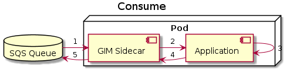

# gim - Gophers In the Middle

[](https://www.gnu.org/licenses/gpl-3.0)


A sidecar implementation built on top of [go-sqs](https://github.com/engelmi/go-sqs) intended to provide HTTP Endpoints for sending messages to and receiving them from [AWS-SQS](https://aws.amazon.com/de/sqs/) queues, which can be called by the main application inside a pod. 

## Usage

### As standalone
```bash
docker run -p <host-port>:<gim-producer-port> \
  -e GIMCONFIG=<config-string> \
  -e AWS_ACCESS_KEY_ID='foo' \
  -e AWS_SECRET_ACCESS_KEY='bar' \
  engelmic/gim
```
Where `<config-string>` contains the configuration for all consumer and producer as well as the logger. The config definition can be seen in [pkg/config/gim.go](pkg/config/gim.go) and [examples/config/sample.json](examples/config/sample.json) contains an example configuration. 

### As a sidecar
An example on how to use `gim` as a sidecar can be seen [here](examples/k8s/README.md).

## Features

### Consume 


The consume routine of the `gim sidecar` looks roughly like this:
1. listen for and collect batches of messages in the queue
2. forward each message to the application
3. process the message
4. the application responds either with status code `200` for successfully processing the message or `any other status code` if it failed processing it
5. on status code `200`, `gim` removes the message from the queue and, otherwise, leaves the message in the queue for re-consumption

### Produce


The produce routine of the `gim sidecar` looks roughly like this:
1. the application sends a `POST /<name-of-producer>/produce` request to `gim`
2. `gim` pushes the message to the specified queue
3. on success, `gim` responds with status code `201` and, otherwise, with `500`